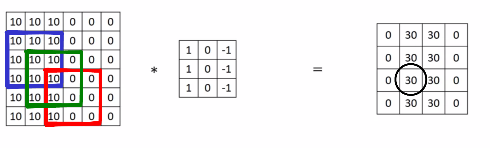

**1. What do you think applying this filter to a grayscale image will do?**
$$
  \left[ {\begin{array}{cc}
    -1 & -1 & 2 \\
    -1 & 2 & 1 \\
    2 & 1 & 1 \\
  \end{array} } \right]
$$

- [ ] Detecting image contrast.
- [x] Detect 45-degree edges.
- [ ] Detect horizontal edges.
- [ ] Detect vertical edges.

Note: Correct. Notice that there is a high delta between the values in the top left part and the ones in the bottom right part. When convolving this filter on a grayscale image, the edges forming a 45-degree angle with the horizontal will be detected.

**2. Suppose your input is a 128 by 128 grayscale image, and you are not using a convolutional network. If the first hidden layer has 256 neurons, each one fully connected to the input, how many parameters does this hidden layer have (including the bias parameters)?**

- [ ] 4194304
- [x] 4194560
- [ ] 12582912
- [ ] 12583168

Note: Correct, the number of inputs for each unit is $128 \times 128$ since the input image is grayscale, so we need $128×128×256$ parameters for the weights and $256$ parameters for the bias thus $128×128×256+256=4194560$.

**3. Suppose your input is a 256 by 256 grayscale image, and you use a convolutional layer with 128 filters that are each 3×33×3. How many parameters does this hidden layer have (including the bias parameters)?**

- [ ] 75497600
- [ ] 3584
- [x] 1280
- [ ] 1152

Note: Yes, since the input volume has only one channel each filter has $3×3+1$ weights including the bias, thus the total is $(3×3+1)×128$.

**4. You have an input volume that is $127×127×16$, and convolve it with 32 filters of $5×5$, using a stride of $2$ and no padding. What is the output volume?**

- [ ] $123×123×32$
- [x] $62×62×32$
- [ ] $62×62×16$
- [ ] $123×123×16$

Note: Correct, using the formula $n_H^{[l]}=\frac{n_H^{[l−1]}+2×p−f}{s}+1$ with $n_H^{[l−1]} = 127$, $p = 0$, $f = 5$, and $s = 2$ we get 62.

**5. You have an input volume that is 31x31x32, and pad it using “pad=1”. What is the dimension of the resulting volume (after padding)?**

- [ ] 32x32x32
- [ ] 31x31x34
- [ ] 33x33x33
- [x] 33x33x32

Note: Yes, if the padding is 1 you add 2 to the height dimension and 2 to the width dimension.

**6. You have a volume that is $121×121×32$, and convolve it with 32 filters of $5×5$, and a stride of $1$. You want to use a "same" convolution. What is the padding?**

- [ ] 0
- [ ] 3
- [ ] 5
- [x] 2

Note: Yes, when using a padding of 2 the output volume has $n_H=\frac{121−5+4}{1}+1$.

**7. You have an input volume that is 32x32x16, and apply max pooling with a stride of 2 and a filter size of 2. What is the output volume?**

- [ ] 16x16x8
- [ ] 32x32x8
- [ ] 15x15x16
- [x] 16x16x16

Note: Correct, using the following formula: $n_H^{[l]}=\frac{n_H^{[l−1]}+2×p−f}{s}+1$

**8. Which of the following are hyperparameters of the pooling layers? (Choose all that apply)**

- [ ] Number of filters.
- [ ] Average weights.
- [ ] Filter size.
- [x] Whether it is max or average.
  - Note: Yes, these are the two types of pooling discussed in the lectures, and choosing which to use is considered a hyperparameter.

**9. Which of the following are true about convolutional layers? (Check all that apply)**

- [ ] It speeds up the training since we don't need to compute the gradient for convolutional layers.
- [x] It allows a feature detector to be used in multiple locations throughout the whole input volume.
  - Yes, since convolution involves sliding the filter throughout the whole input volume the feature detector is computed over all the volume.
- [x] Convolutional layers provide sparsity of connections.
  - Yes, this happens since the next activation layer depends only on a small number of activations from the previous layer.

**10. The following image depicts the result of a convolution at the right when using a stride of 1 and the filter is shown right next.**

**On which pixels does the circled pixel of the activation at the right depend?**

- [x] It depends on the pixels enclosed by the green square.
- [ ] It depends on all the pixels of the image on the left.
- [ ] It depends on the pixels enclosed by the red square.
- [ ] It depends on the pixels enclosed by the blue square.

Note: Yes, this is the position of the filter when we move it two pixels down and one to the right.

---

**1. What do you think applying this filter to a grayscale image will do?**

$$
  \left[ {\begin{array}{cc}
    0 & 1 & 1 & 0 \\
    1 & 3 & 3 & 1 \\
    -1 & -3 & -3 & -1 \\
    0 & -1 & -1 & 0 \\
  \end{array} } \right]
$$

- [ ] Detect vertical edges.
- [ ] Detect 45-degree edges.
- [ ] Detecting image contrast.
- [x] Detect horizontal edges.

**2. Suppose your input is a 128 by 128 color (RGB) image, and you are not using a convolutional network. If the first hidden layer has 64 neurons, each one fully connected to the input, how many parameters does this hidden layer have (including the bias parameters)?**

- [ ] 1048576
- [ ] 3145728
- [ ] 1048640
- [x] 3145792

**3. Suppose your input is a 300 by 300 color (RGB) image, and you use a convolutional layer with 100 filters that are each 5x5. How many parameters does this hidden layer have (including the bias parameters)?**

- [x] 2501
- [ ] 7600
- [ ] 2600
- [ ] 7500

**5. You have an input volume that is 61x61x32, and pad it using “pad=3”. What is the dimension of the resulting volume (after padding)?**

- [ ] 64x64x32
- [ ] 64x64x35
- [x] 67x67x32
- [ ] 61x61x35

**7. You have an input volume that is 128x128x12, and apply max pooling with a stride of 4 and a filter size of 4. What is the output volume?**

- [ ] $32×32×3$
- [x] $32×32×12$
- [ ] $64×64×12$
- [ ] $128×128×3$

**8. Because pooling layers do not have parameters, they do not affect the backpropagation (derivatives) calculation.**

- [ ] True
- [x] False

Note: Everything that influences the loss should appear in the backpropagation because we are computing derivatives. In fact, pooling layers modify the input by choosing one value out of several values in their input volume. Also, to compute derivatives for the layers that have parameters (Convolutions, Fully-Connected), we still need to backpropagate the gradient through the Pooling layers.

**9. In lecture we talked about “parameter sharing” as a benefit of using convolutional networks. Which of the following statements about parameter sharing in ConvNets are true? (Check all that apply)**

- [ ] It allows gradient descent to set many of the parameters to zero, thus making the connections sparse.
- [x] It allows a feature detector to be used in multiple locations throughout the whole input image/input volume.
  - Yes, by sliding a filter of parameters over the entire input volume, we make sure a feature detector can be used in multiple locations.
- [ ] It allows parameters learned for one task to be shared even for a different task (transfer learning).
- [x] It reduces the total number of parameters, thus reducing overfitting.
  - Yes, a convolutional layer uses parameter sharing and usually has a lot less parameters than a fully-connected layer.

**10. The sparsity of connections and weight sharing are mechanisms that allow us to use fewer parameters in a convolutional layer making it possible to train a network with smaller training sets. True/False?**

- [x] True
- [ ] False

Note: Yes, weight sharing reduces significantly the number of parameters in a neural network, and sparsity of connections allows us to use a smaller number of inputs thus reducing even further the number of parameters.

---

**8. Which of the following are hyperparameters of the pooling layers? (Choose all that apply)**

- [ ] W[l] weights.
- [x] Stride
  - Yes, although usually, we set f=s this is one of the hyperparameters of a pooling layer.
- [ ] b[l] bias.
- [x] Whether it is max or average.
  - Yes, these are the two types of pooling discussed in the lectures, and choosing which to use is considered a hyperparameter.